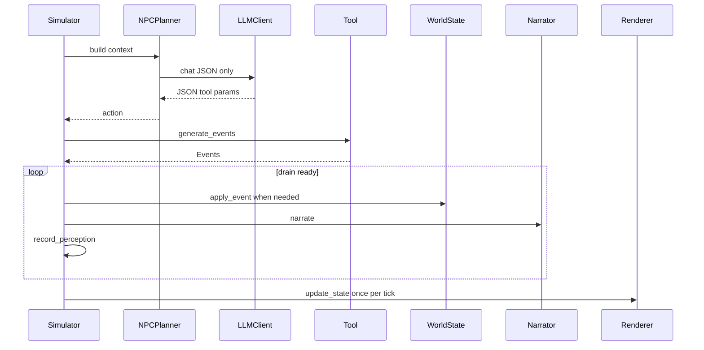
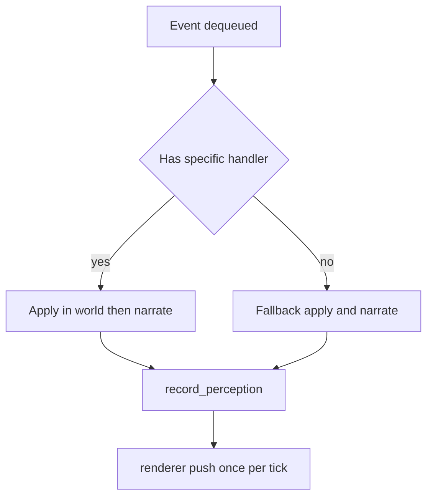

# Living Tapestry Engine Architecture

Status: read only familiarization. No API edits were made. LLM config remains local in config/llm.json.

## Overview

The engine simulates a small RPG world where actors perform actions selected either by a planner using an LLM or by player input. Deterministic state changes happen only in WorldState.apply_event. Rendering is optional via a pygame adapter.

## Key Modules

- Data models: engine/data_models.py
- Events and perception: engine/events.py
- World state and mutations: engine/world_state.py
- Simulator orchestration: engine/simulator.py
- Tools action implementations: engine/tools/*
- Planner and LLM client: engine/npc_planner.py, engine/llm_client.py
- Narration: engine/narrator.py
- Combat rules: rpg/combat_rules.py
- Web interface: web/server.py, web/static/*
- Scripts: scripts/cli_game.py, scripts/export_monolith.py

## Data Model

NPC, LocationStatic, LocationState, ItemBlueprint, ItemInstance, Memory, Goal, PerceptionEvent are simple dataclasses used across the engine.

## World State

- Load assets from data directory
- Hydrate dynamic connections_state with directions from hex layout
- Deterministic mutations through apply_event for all supported event types
- Passive effects with update_hunger generating starvation damage events

## Event Envelope and Perception

- Event carries event_type, tick, actor_id, target_ids, payload
- make_perception_from_event strips to a compact PerceptionEvent for short term memory
- Simulator.record_perception appends to recipient NPCs based on rules for proximity and sound reach

## Tools

- Each Tool validates intent against the current dynamic world and emits Events
- Tools are registered into Simulator.tools and then discoverable by planner available_tools
- Example tools: move, talk, talk_loud, scream, look, grab, drop, attack, equip, unequip, analyze, eat, give, open, close, toggle_starvation, wait, rest, interject, leave_conversation
- GM only meta tools: reason, reflect apply through deterministic handlers without direct world mutations by tools

## Simulator

- run_one_npc_turn executes a single NPC action by calling NPCPlanner.plan and then process_command
- process_command normalizes params, validates via Tool.validate_intent, enqueues events, and advances the actor cooldown
- tick advances time, applies passive world effects, drains ready events through handle_event, then updates the renderer once
- Conversations are created and advanced in simulator handlers with turn order, interjections, and garbage collection
- _renderer_push_state builds minimal actor list and UI meta including __connections_state__ and layout signature

## Planner and LLM

- NPCPlanner builds a working_memory slice goals core memories short term perceptions and retrieved memories
- It composes tool_schemas and tiny examples for available tools, then asks LLMClient for a single JSON object
- Robust parsing strips think blocks and extracts JSON
- The planner validates and can attempt a minimal self repair, else falls back to a safe wait action
- LLMClient reads endpoint and headers from config/llm.json on your machine; no keys are stored in repo

## Narration

- Narrator maps events to short textual descriptions used in logs and as actor chat bubbles

## Renderer

- PygameHexRenderer draws top level and sublocation hexes, actors, bubbles, and dynamic open or closed edges
- Simulator sends actor list and messages; renderer extracts __connections_state__ and ignores any static neighbors

## Entry Points

- scripts/cli_game.py interactive loop with LLM intent mapping for the player
- web/server.py web interface with REST API and WebSocket support
- scripts/export_monolith.py utility to export engine/rpg code as monolith and zip

## Invariants and Safety

- Tools never mutate world directly; only WorldState.apply_event changes world state
- Tool.validate_intent checks dynamic state to prevent impossible actions
- Simulator blocks out of turn talk in active conversations to keep flow consistent
- Deterministic cognitive mutations occur only through reason and reflect handlers with allowlists

## How to Add a New Action

1. Implement a Tool subclass with validate_intent and generate_events
2. Register it with Simulator.register_tool at startup
3. Add a narration handler in Narrator or rely on default handle_event path
4. Optionally add a schema and tiny example to NPCPlanner._SCHEMAS and ensure the tool name appears in available_tools so the planner can select it

## Configuration Knobs

- perception_buffer_size controls STM cap for NPCs default 30 read in Simulator.__init__
- retrieval_top_k controls number of retrieved LTM items for planner default 6 used in build_working_memory
- Starvation toggling can be done via toggle_starvation tool for quick demos

## Sequence Diagram planner to action to world to UI

## Event Handling Flow

## Tool Map Quick Reference

- move MoveTool -> move event world moves actor if target open neighbor
- talk TalkTool -> talk event conversation turn logic in simulator
- talk_loud TalkLoudTool -> talk_loud event audible to neighbors when open
- scream ScreamTool -> scream event audible to neighbors regardless of door
- look LookTool -> describe_location event no state change
- attack AttackTool -> attack_attempt followed by attack_hit or attack_missed and possibly damage_applied
- grab drop equip unequip analyze eat give open close wait rest toggle_starvation interject leave_conversation as named

## Notes and Small Suggestions

- Planner already allows look but does not include a tiny schema example for it; adding one might improve consistency but is optional. No change has been made.
- API configuration remains on your machine; the engine reads config/llm.json at runtime and never exposes it.

End